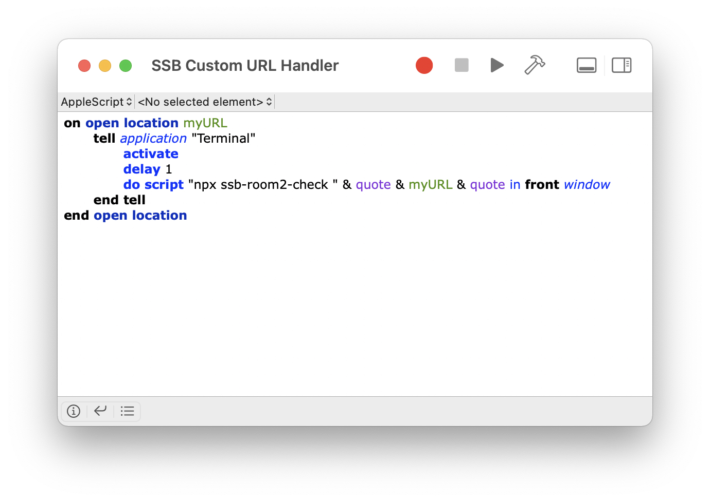
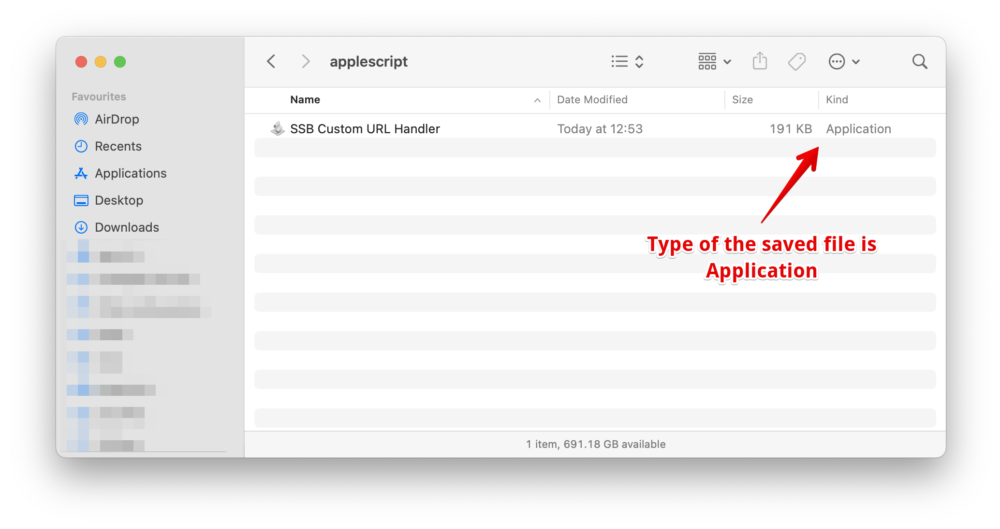
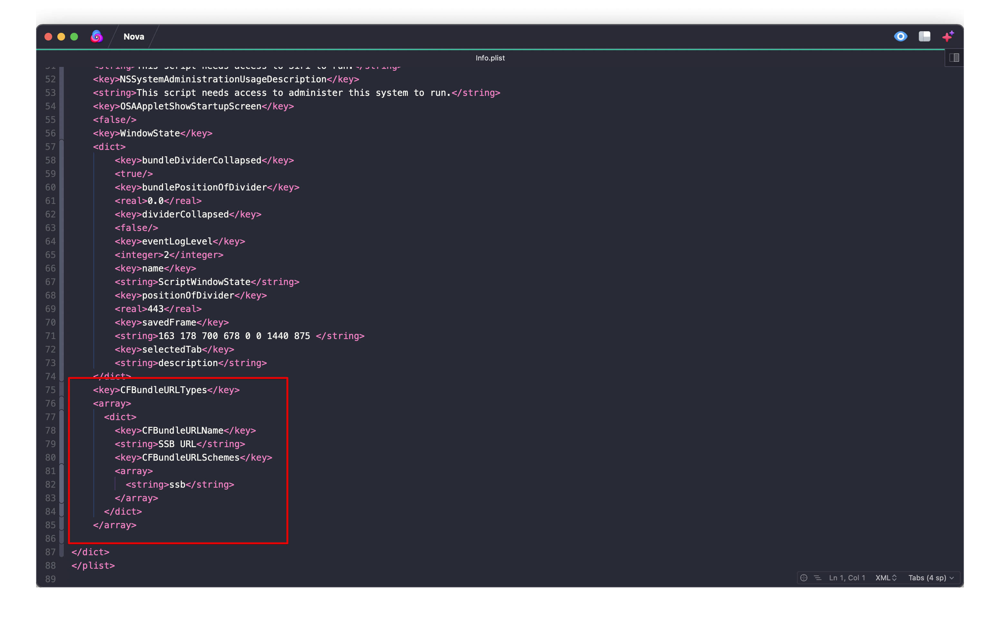

# Creating an `SSB:` Custom Handler for macOS

The easiest way of doing it, that is built-in with all macs, is to use AppleScript. Open the _AppleScript Editor_ and create a new document with the following script:

```AppleScript
on open location myURL
    do shell script "npx ssb-room2-check " & myURL
end open location
```

This is how it looks in the _AppleScript Editor_:



Save it changing the type to _Application_ instead of the default setting which is _Script_. This will make an application for you. You can name it whatever you want. Here is a shot of saving it as an _Application_ and naming it _SSB Custom URL Handler_, notice that the type of the bundle is _Application_:



You'll need to change the `Info.plist` inside the _Application bundle_ you just saved. To do that, _CTRL+Click_ the saved bundle and select _Show package contents_. Inside that bundle, use your favourite programming text editor to edit the file inside `Contents/Info.plist`.

At the end of the file, but before the last `</dict>`, you need to add the necessary entry to handle the _ssb schema handler_:

```xml
<key>CFBundleURLTypes</key>
<array>
  <dict>
	<key>CFBundleURLName</key>
	<string>SSB URL</string>
	<key>CFBundleURLSchemes</key>
	<array>
	  <string>ssb</string>
	</array>
  </dict>
</array>
```

Save your `Info.plist`, and run the Application once. It won't do anything but it will register itself as the handler for `ssb:` URLs. From now on, when you try to launch a `ssb:` URL, macOS will ask you to run it with your custom handler.

Be aware that for the handler to work you need to have both NodeJS and NPM installed as it uses `npx` to run the `ssb-room2-check` command.

---

### Troubleshooting

The easiest part to get it wrong is to mess up the `Info.plist` file. Here is a shot how it should look after you change it:


